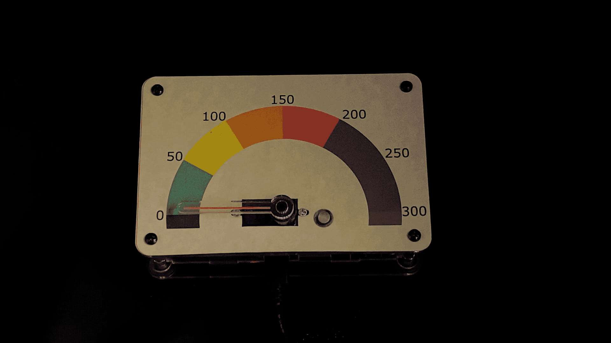

# ProtoStax_Air_Quality_Monitor

Demo for ProtoStax Air Quality Monitor with Raspberry Pi, Micro Servo,
RGB LED and ProtoStax Enclosure



using [ProtoStax for Raspberry Pi A+](https://www.protostax.com/products/protostax-for-raspberry-pi-a)

You can also use
[ProtoStax for Raspberry Pi B+](https://www.protostax.com/products/protostax-for-raspberry-pi-b)
and Raspberry Pi 3B+/4B
or
 [ProtoStax for Raspberry Pi Zero](https://www.protostax.com/products/protostax-for-raspberry-pi-zero)
 and Raspberry Pi Zero

## Prerequisites

* Enable GPIO on the Raspberry Pi
* Station ID from Purple Air Station -
[https://purpleair.com](https://purpleair.com/) - see
aqi_monitor.py comments for more details

**Install RPi.gpio**

```
sudo apt-get install rpi.gpio
```

## Installing

```
git clone https://github.com/protostax/ProtoStax_Air_Quality_Monitor.git
```

## Usage

```
cd ProtoStax_Air_Quality_Monitor
```

Calibrate your micro servo first. Find the min, max and center duty
cycles for your given micro servo with its analog gauge. Follow the
instructions in servo_test.py

Edit aqi_monitor.py to update MIN_DUTY, MAX_DUTY and CENTER_DUTY
values.

Finish wiring your micro servo and RGB LED as shown in the Fritzing diagram

Run your Air Quality Monitor as follows:

```
python aqi_monitor.py -S <STATION_ID of Purple Air Station>
```

where you get the station ID of the Air Quality station of interest
from Purple Air

## License

Written by Sridhar Rajagopal for ProtoStax. BSD license, all text above must be included in any redistribution

A lot of time and effort has gone into providing this and other code. Please support ProtoStax by purchasing products from us!


